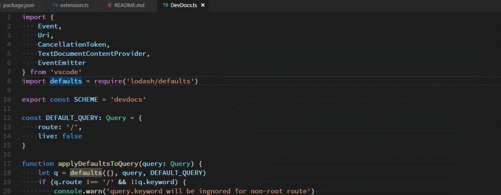

# vscode-devdocs README

Search documentation on devdocs.io inside VSCode



## Commands

Name                 | Description                                                 | Keybindings
-------------------- | ----------------------------------------------------------- | ------------
devdocs.quickSearch  | Search DevDocs with the word under cursor or selected words | `alt+shift+d`
devdocs.search       | Search DevDocs with keywords                                |
devdocs.home         | Open DevDocs home                                           |
devdocs.settings     | Open DevDocs settings page                                  | 
devdocs.offline      | Open DevDocs offline data page                              |

## General Notes

This is a simple wrapper around devdocs.io. All documentations are provided and hosted by devdocs.io.
The extension has no control over DevDocs. For best user experience, you should configure it manually:

* Run `devdocs.settings`. You can choose enabled documents, use dark theme and/or hide sidebar as needed
* Run `devdocs.offline` to cache documentations locally

For further information, please refer to [DevDocs Help](http://devdocs.io/help).

## Extension Settings

This extension contributes the following setting:

```json
"devdocs.column": {
    "type": "number",
    "default": 2,
    "description": "A number which indicates which column (1, 2, or 3) to display DevDocs in"
}
```

## Known Issues

* Document list in `devdocs.settings` page might be buggy (lose scroll position on first click)

## Release Notes

### 1.0.0

Initial release